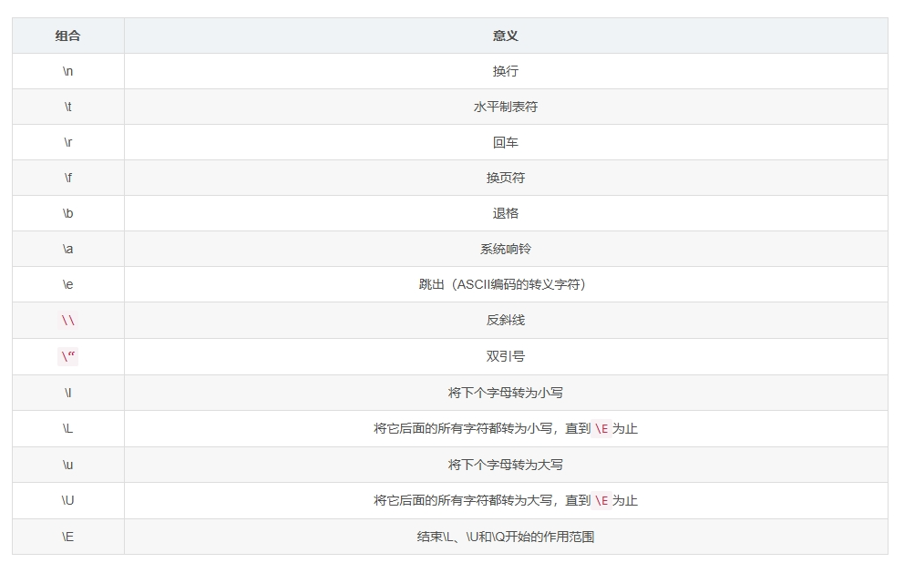
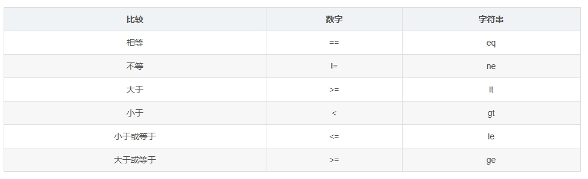

# Learning Perl
# 1 简介
## 1.1 注释
注释是从一个井号（#）一直到行尾的内容。
* #!/usr/bin/perl
每个Perl语言的开头，都是以类似:
```
#!/usr/bin/perl
```
还可以通过shebang行上执行外部命令自动定位perl解释器的路径：
```
#!/usr/bin/envperl
```
## 1.2 ;结尾
以分号（;）结尾，目的是分割不同的Perl语句不是换行。
## 1.3 一个简单的程序
```
#!/usr/nom/perl
use 5.010; #Perl 5.10版本
print "Hello,world!\n";

#say "Hello.world!" #不需要换行符
```
## 1.4 程序里写什么
* Perl通常可以随意加上空白符（空格、制表符、换行符）
* Perl没有注释块的概念
* Perl不用子程序
* 括号只要不改变原意是可以省略
# 2 scalar标量数据
## 2.1 定义
* 标量数据：表示数据的内容，就是值；
* 标量变量：表示存储标量数据的容器；
### 2.1.1 数字
直接量（Literal）是指直接在源代码中给出的固定值，它们不需要通过计算或变量引用来确定。直接量可以是多种不同的数据类型，包括数字、字符串、正则表达式等。
* 浮点数直接量
* 整数直接量
* 非十进制的整数直接量
    * 前置0
* 数字操作符
### 2.1.2 字符串
一般范围介于ASCⅡ编码的32到126之间<br>
字符串可以使用任意一个合法的Unicode字符，但是得手工加上：
```
use utf8;
```
借助代码点（code point）创建字符，再使用chr()转换为字符串（ord()把字符串转换为代码点）
* 单引号
表示本身；只有在反斜线后面接续单引号或者反斜线时，才表示转义。
* 双引号
转义字符，或者用十六进制和八进制表示任何字符<br>
    * 双引号内的字符串的反斜线转义：<br>

    * 变量内插：字符串内的变量名称替换为该变量当前的值。<br>
    可以使用花括号{}避免歧义<br>
    可使用\x{}形式进行代码点内插
* 字符串操作符
    * 字符串可以使用句点符号`.`进行拼接！
    * 小写字母x：字符串重复操作符（重复几次），左操作数必须是字符串类型，右操作数在使用前取整，小于1则是长度为0的空字符串
    * 数字和字符串之间的类型转换完全取决于操作符，会自动转换(十进制数字)
## 2.2 内置警告
通过编译指令开启：
```
use warnings;
```
命令行加上-w选项开启：
```
perl -w my_program
```
在shebang行上：
```
#!/usr/bin/perl-w
```
更详尽的问题描述；`use diagnostics;`，优化：`perl -M`
```
$perl -Mdiagnostics ./my_program
```
## 2.3 标量变量：存储一个值的变量 
\$_ 是 Perl 中的变量标识符
* 双目赋值操作符
## 2.4 操作符
* 优先级 --> 直接括号
* 比较操作符

## 2.5 控制结构
### 2.5.1 if
```
if(){
    ...;
}else{
    ...;
}

if(){
    ...;
}elsif(){
    ...;
}else{
    ...;
}
```
* 布尔值：<br>
用`!`这个单目取反操作符，颠倒真假值
* undef值
变量的初始值，未定义值
* defined函数
判断字符串是undef还是空字符串，可以使用defined函数，是undef返回假
### 2.3.2 while
```
while(){
    ...;
}
```
内部是布尔上下文（特殊的标量上下文）
## 2.6 获取用户输入：<STDIN>
由<STDIN>返回的字符串一般都在末尾有换行符，可以用chomp()去除末尾换行符
* chomp()
只能作用于单个变量，且该变量的内容是字符串，且只能删除一个换行符，返回值是实际移除的字符数（一个换行符是1）
# 3 list and array
列表（list）：是一个有序（从零开始）的标量集合；<br>

数组（array）：是一个包含列表的变量，一定包含一个列表。<br>

因此，简单地说，列表是数据，而数组是变量。<br>
以$开头的总是标量，<br>
以@开头的总是数组，<br>
以%开头的总是哈希。<br>
## 3.1 访问数组元素
```
@array

$array[index]
#索引超过尾端是undef
#小数自动去除小数部分
```
访问最后一个元素：`$array[$#array]`，$#array表示数组的最后一个索引数字号。
## 3.2 列表直接量
圆括号内用逗号隔开的一串数据，一个数据就是一个列表元素。
* ".."范围操作符
".."运算符表示一个区间，譬如1..5，表示从1到5的五个数字（1 2 3 4 5），一般用于列表或数组的赋值中。只能从小到大，自动整数。
* qw简写
quoted word建立简单的单词列表（字符串元素），抛弃空格，给每个元素加上引号。<br>
    * 可以使用圆括号()作定界符，也可以{},[],<>,!!,//,##
## 3.3 列表的赋值
### 3.3.1 直接赋值
```
($fred, $barney, $dino) = ("flintstone", "rubble", undef)
```
* 多出来的值会被忽略，多出来的变量会被设为undef。
* 引用数组的时候会被展开成它所拥有的元素列表，因为数组只能包含标量，不能包含其他数组。
### 3.3.2 pop和push操作符
* 删除和增加数组末尾元素，并作为值返回。空返回undef。
### 3.3.3 shift和unshift操作符
* 删除和增加数组开头元素，并作为值返回。空返回undef。
```
my $file = shift
#shift 是一个内置函数，用于从数组的开始位置移除元素并返回它。这行代码通常用在脚本的开始处，用于获取脚本的第一个命令行参数。
```
### 3.3.4 splice
* 添加或移除数组中间的某些元素。（索引从零开始）
```
splice 要操作的数组，开始位置，[操作的长度]，[要替换的列表];
```
### 3.3.5 reverse
* 反向返回列表值
### 3.3.6 sort
* 排序
### 3.3.7 each
* 返回数组中下一个元素所对应的两个值（索引以及值）
## 3.4 字符串的数组内插
* 内插到双引号，自动添加分隔的空格符。
* 索引表达式会被当成普通字符串表达式处理，表达式中的变量不会被内插。
## 3.5 foreach控制结构
遍历列表中的值
```
foreach $array (@array){
    ...;
}
```
* 控制变量
如$array
* 默认变量：$_
在foreach开头省略控制变量时，会默认使用$_
## 3.6 标量上下文以及列表上下文
* 标量上下文使用产生列表的表达式
列表值-->列表元素的个数
* 列表上下文使用产生标量的表达式
* 强制指定标量上下文
使用伪函数scalar @array
* wantarray函数判断上下文
# 4 subroutine子程序
自定义函数
## 4.1 定义子程序
```
sub subroutine_name {
    ...;
}
```
## 4.2 调用格式
与好（可省略）+子程序名   `&subroutine_name`<br>
子程序与Perl内置函数同名的时候要加上&
## 4.3 返回值
返回值是最后执行的表达式（不一定要最后一行）的结果。
* return操作符
子程序执行到一半就停止
* 非标量返回值
## 4.4 参数
传递参数列表到子程序，`&subroutine_name(参数1，参数2....)`
* 变长参数列表：更长的列表作为参数传给子程序
最好是让子程序适应任意数目的参数
* 空参数列表
## 4.5 私有变量
* 使用`my`定义私有变量（词法变量），其作用范围为最小的代码块。<br>
* my可以在if、while等语句块中使用
* 控制变量也可以加上my
为了告诉Perl执行严格的语法规则检查，可以把`use strict pragma`放在程序顶部（或在任何你希望强制使用这些规则的块或文件中）
> 开启这个编译指令，就要求在自定义变量声明前，必须加上my <br>
> use strict;:强制使用严格、良好的编程风格<br>
> use v5.12:自动加载strict编译指令<br>
> 大部分人的建议：比屏幕长的程序都应该加上use strict
* 持久性私有变量
state来声明变量 `state $varible = ..`<br>
在子程序的多次调用期间保留之前变量的值。
* our 全局变量

# 5 输入与输出
## 5.1 读取标准输入
行输入操作符<STDIN>
## 5.2 钻石操作符<>
* 调用参数-通常是命令行上跟在程序后面的几个“单词”。
* 调用参数来自数组@ARGV
```
while(<>){
    chomp;
    print "it was $_ that i saw\n";
}
```
## 5.3 输出到标准输出
* 使用print函数向标注输出进行无格式的输出
```
print @array;
print "@array";
```
## 5.4 printf格式化输出
参数包括：格式化字符串和要输出的数据列表
* 使用printf函数向标准输出进行格式化的输出
   * %g：g表示General，要按一般较合适的方式打印一个数字，可以使用%g，它会根据需要自动选择浮点、整数，甚至是指数表示；
   * %d：表示十进制整数，会根据需要对数据进行截取（注意，不是舍入）；类似的，%x表示十六进制，%o表示八进制；在d前面加上整数，可以表示需要打印的字段宽度，若整数为负数，则表示左对齐；%6d
   * %s：表示一个字符串，它按字符串进行给定值的替换，但有一个给定的字段宽
   * %f：表示浮点数，它会根据需要进行舍入，可以指定小数点后的位数，譬如，printf "%3fn", 6*7 + 2/3;->```42.667
   * %%：打印一个真正的百分号，它的特殊之处在于它不需要列表中的元素与之对应。
* 数组和printf
```
printf "the items are:\n" . ("%10s\n x @items), @items;
```
## 5.5文件句柄
> 文件句柄是用于引用和操作文件的标识符。当你在程序中打开一个文件时，操作系统会返回一个文件句柄，这是一个抽象的概念，用于在程序中唯一标识该文件。通过这个文件句柄，程序可以读取文件内容、写入数据或者执行其他文件操作，如关闭文件。<br>
标准文件句柄：STDIN、STDOUT、STDERR、DATA、ARGV、ARGVOUT
### 5.5.1 打开文件句柄
`open`，默认是读取数据。
```
open CONFIG, 'dino';
open CONFIG, '<dino';#两行完全相同
```
* >, <, >>
* 三个参数形式：open 句柄， ‘文件操作符’，输入或输出文件
    * 转换字符编码：文件操作符后面加`:encoding(编码名称)`
    * 层，如culf层
* 以二进制方式读写：
binmode 关闭换行符相关处理： binmode STDOUT;
binmode 指定特定行为： binmode STDIN, ':encoding(UTF-8)';
* 有问题的文件句柄
### 5.5.2 关闭文件句柄
`close`
### 5.5.3 使用文件句柄
使用print/printf写入或添加
```
print LOG "Captain's log, stardate 3.14159\n";
#文件句柄和输出文件之间没有逗号
```
### 5.5.4 改变默认的文件句柄
`select`
立刻刷新：
```
select LOG;
$| = 1;
```
### 5.5.5 重新打开标准文件句柄
### 5.5.6 标量变量的文件句柄
将文件句柄存放到句柄中，变量名后加_fh后缀表示，可以用词法变量确保该变量是空的。
## 5.6 die处理致命错误
die会输出指定信息到标准错物流，立刻终止程序并返回不为`零`的退出码。<br>
* $!存储系统错误信息，给出解释
* 会附加行号和程序名在错误信息后面
* 加上\n：不显示行号和文件名
* 可用于检查open的返回值
```
if ( ! open LOG, '>>', 'logfile' ){
    die "Cannot create logfile: $!";
}
```
### 5.6.1 warn
### 5.6.2 自动检测致命错误autodie
```
use autodie;
#检查open的返回值，如果失败，自动启动die
```
## 5.7 say输出
打印每行内容时自动添加换行符
# 6 hash哈希
键是唯一的字符串
## 6.1 访问哈希元素
```
$hash{$some_key}
```
* 访问整个哈希 `%hash`
* 展开哈希
```
@any_array = %some_hash
#顺序会改变，但键值还是黏着的
```
## 6.2 哈希赋值
```
my %new_hash = %old_hash
```
* 键值互换（唯一情况下）
```
my %inverse_hash = reverse %any_hash
```
* 胖箭头
可以省略左边的引号（--裸字——无需引号的字符串）<br>
花括号内也可以省略引号但不是裸字
## 6.3 哈希函数
* keys和values
分别返回哈希的键和值列表，没有成员则返回空列表，但不能预测顺序；在标量上下文中返回哈希中元素的个数
* each函数
遍历哈希，包含两个元素的列表的形式返回键-值对，while循环中：
```
while (($key, $value) = each %hash){
    print "$key => $value\n";
}
#依旧乱序
```
* exist
是否存在某个键
* delete
删除指定键值
## 6.4 %ENV哈希
访问环境
```
print "PATH is $ENV{PATH}\n";
```
# 7 regular expression正则表达式
两种模式：匹配和不匹配
## 7.1 简单模式
/ /之间
* Unicode属性 \p{PROPERTY}
* 元字符：
    * 点号`.`能匹配除换行外的任意单个字符，换行符除外  
    * 量词：
        * 星号（*）：匹配前面的条目零次或多次；
        * 加号（+）：匹配前面的条目一次或多次；
        * 问号（？）：匹配前面的条目零次或一次，即前面的条目是可选的；
    * 模式分组：
        * 用圆括号( )将模式字符串分组，捕获组
        * 反向引用是在反斜线后面加上数字，数字代表相应顺序的捕获组（左括号），如(.)\1：匹配连续出现的两个同样字符
    * 则一匹配
        * 竖线|，或
## 7.2 字符集
[]内表示，只匹配单个字符，但可以是字符集中的任意一个<br>
脱字符[^],匹配除括号内字符的字符
* \d：匹配所有数字的字符类，等价于[0-9]；d是digital的缩写
* \w：匹配所谓的“单词”字符，即普通字母、数字和下划线，等价于[A-Za-z0-9_]；w是word的缩写
* \s：匹配空白，包括换页符、制表符、换行符、回车符和空个字符，等价于[\f\t\n\r]；s是space的缩写 \h水平空白符，\v垂直空白符
* \D：匹配所有非数字字符类，即d的反置形式，等价于[^d]；
* \W：匹配所有的非“单词”字符，即w的反置形式，等价于[^w]；
* \S：匹配所有的非空白字符，即s的反置形式，等价于[^s]；
* \R: 匹配任意一种断行符
# 8 使用正则表达式进行匹配
* m//进行匹配
    * 模式匹配操作符：m( )，m< >，m{ }，m[],其中选择斜线作为定界符时，一般省略前面的m，变成了/ /
## 8.1 模式匹配修饰符
改变默认的匹配行为
* 用/i进行大小写无关的匹配
* 用/s匹配任意字符
    * /.*/s：可以匹配到换行符
    * 如果不习惯用/s修饰符，可以使用[\D\d],[\S\s]等，原理就是数字字符以及非数字字符组合就是任意字符。
* 用/x加入辅助空白字符
使用这个之后，可以在模式里使用空格或换行使得代码可读性更高！
* 组合选项修饰符
* 选择字符解释方式
对大小写的处理以及对字符集合的阐释。
    * /a 严格按照ASCⅡ的范围来匹配数字字符，两个a采取ASCⅡ方式的大小写映射处理
    * /u 采取Unicode的方式
    * /l 采取本地语言的设定
    * /d 采用传统的方式
## 8.2 锚位
* ^与\A一样，$与\z（绝对末尾）一样。\Z允许后面出现换行符
* 如果加上/m修饰符，/^/m就会匹配字符串开头和换行符之后的内容（就是每行开头）
* 单词锚位：
    * \b可以匹配任何单词\w的首尾，偶数个
    * 非单词边界是\B
## 8.3 绑定操作符
=~ 是一个绑定操作符，拿右边的模式匹配左边的字符串，而不是$_
## 8.4 捕获变量
* 捕获变量，把匹配到的内容用标量存储起来，方便调用！一般使用圆括号()进行捕获，`$1 $2`的形式
* 捕获变量的存续期
捕获变量的内容一般会保持到下次成功匹配为止，我们可以将其保存下来的；
* 不捕获模式
在左括号后加上?:,此时的括号仅用于分组，不再捕获匹配字符串。
* 命名捕获
使用如下的捕获标签，可以随意移动位置，并加入更多的捕获括号！
```
use 5.010;

my $names = 'Fred or Barney';
if ($names =~ m/(?<name1>\w+) (?:and|or)(?<name2>\w+)){
	say "I saw $+{name1} and $+(name2)";
}
#捕获到的内容保存到特殊哈希%+中，键就是捕获标签
```
反向引用可以使用\g{label}
* 自动捕获变量
    * $`:匹配内容之前的内容
    * $&:匹配的内容
    * $’:匹配内容之后的内容
    * 修饰符/p可以对当前的表达式开启类似的自动捕获变量，变成了${^PREMATCH},${^MATCH},${^POSTMARTCH}
## 8.5 通用量词
{}的形式指定具体的重复次数范围，如`/a{5,15}/`
## 8.6 优先级

## 8.7 模式测试程序
```
#!/usr/bin/perl
while (<>) {                   # take one input line at a time
    chomp;
    if (/YOUR_PATTERN_GOES_HERE/) {
        print "Matched: |$`<$&>$'|\n";  # the special match vars
    } else {
        print "No match: |$_|\n";
    }
}
```
# 9 正则表达式处理文本
## 9.1 s///进行替换
返回值是布尔值
* /g 全局替换，在匹配的字符串中，所有符合替换模式的部分都会被替换，而不仅仅是第一个匹配的部分。
      常见用于缩减空白 s/...//g
* 可用替换修饰符 /i,/x,/s
* 绑定操作符 =~
* /r无损替换
```
#先复制后替换
(my $copy = $orginal) =~ s/\d+ ribs?/10 ribs/;
```
/r会保留原来字符串变量中的值不变，把替换结果返回
```
use 5.014;
my $copy = $orginal =~ s/\d+ ribs?/10 ribs/r;
#形式上看只是去掉括号，运算是相反的，先替换再赋值
```
* 大小写转换
  * \U将它后面的所有字符转成大写的
  * \L将它后面的所有字符转成小写的
  * 默认情况下，它们会影响之后全部的（替换）字符串，可以用\E关闭大小写转换的功能；
  * 使用小写\l和\u，它们只会影响紧随其后的第一个字符；
  * 同时使用\u与\L来表示"后续字符全部转为小写的，但首字母大写”
## 9.2 split
```
my @fields - split /separator/, $string;
```
不设置分隔符默认以空白分割字符串，但会省略空白开头的空字段
```
my @fields = split; # 基本等效于split /\s+/, $_;
```
## 9.3 join
```
my $result = join $glue, @pieces;
```
join会把胶水涂进每个片段之间并返回结果字符串
```
my $x = join ":",4,6,8,10,12; # $x 为 “4:6：8:10：12”
my @values = split /:/,$x;    # @values 为(4,6,8,10,12)
my $z = join "-", @values;    # $z为 “4-6-8-10-12”
```
## 9.4 列表上下文的m//
```
$_ = "hello there, neighbour!"
my($first, $second, $third) = /(\S+)(\S+),(\S+)/;
```
## 9.5 更强大的正则表达式
### 9.5.1 非贪婪词
加号是一个贪婪量词，正则表达式引擎会进行一个回溯动作<br>
+?除了表示一次或多次，同时能要求字符串越短越好，同理*?,.?,??
### 9.5.2 跨行模式匹配
/m，把m看作多行，代表的是行的开头和结尾
### 9.5.3 一次更新多个文件
特殊变量$^I，如果是字符串，该字符串就会变成备份文件的扩展名，原文件发生改变，如果是空字符串，就不会备份
```
#!/usr/bin/perl -w
use strict;
chomp(my $date = `date`);
$^I = ".bak";
while (<>){
	s/Randall/Randal/;
	print;
}
#perl -p -i.bak -w -e 's/Randall/Randal/g' fred*.dat
```
### 9.5.4 perl单行程序
* -e 执行后续字符串，指定的程序中可以省略末尾的分号
* -n 逐行读取输入文件
* -p “processing”模式，它使得Perl脚本在读取输入的同时进行处理，并打印修改后的结果。如下
```
while (<>){
	print;
}
```
* -i.bak 其作用就是在程序开始之前把$^I设置为".bak"
* -w 开启警告
* - 表示 Perl 从标准输入读取脚本。
* -v 选项启用详细模式，显示版本信息。
* -l 使得 Perl 自动为每个输入行添加换行符。
* -a 使得 Perl 将输入行自动分割到 @F 数组中。
* -F 是一个 Perl 命令行开关，用于设置输入字段的分隔符（field separator），如-F"\t"
  当使用 -F"\t" 时，Perl 会将输入的每行文本按照制表符进行分割，并将分割后的部分存储在默认的数组 @F 中。这样，您可以通过 $F[0]、$F[1] 等访问每一列的值。
# 10 其他控制结构
## 10.1 unless控制结构
if条件为真时执行，unless条件为假时执行<br>
可用否定操作符！来否定条件表达式
* 伴随unless的else语句
就是if else改成了unless else
## 10.2 until控制结构
颠倒while的条件表达式，就用until
```
until ($j >$i){
	$j *=2
}
```
## 10.3 表达式修饰符
表达式后面可以接一个控制它行为的修饰符(if, unless, while, until, foreach)
* 简化代码书写
* 即使条件表达式写在后面，它也会先执行
* 倒装句
```
print "$n is a negative number.\n" if $n < 0;
```
* foreach无法自选控制变量，必须得是$_
## 10.4 裸块
没有关键字和表达式的代码块，并非循环<br>
{ }主要是为变量限制作用域
## 10.5 elsif子句
## 10.6 自增自减
* 自增操作符：++，能将标量变量加1
* 自减：--
* 前置自增/自减：++/--写在变量前面就能先增加变量的值然后获得新值
* 后置自增/自减：先取值
## 10.7 for控制结构
```
for (初始化；测试；增减){
	程序主体；
	程序主体；
}
```
与while相同：
```
初始化；
while (测试){
	程序主体；
	程序主体；
	增减；
}
```
* foreach和for：是等价的，如果后面括号内有两个分号就是for循环，没有分号就是foreach
## 10.8 循环控制
Perl中5中循环块：for, foreach, while, until以及裸块
* last操作符
和c语言的break一样，退出循环
* next操作符
和c语言的continue一样，跳过本次循环
* redo操作符
返回到当前循环的顶端，重新执行这次迭代
* 带标签的块
将标签和冒号位于循环的前面
## 10.9 条件操作符?:
* 三目运算符? :
* expression ? if_true_expr : if_false_expr
## 10.10 逻辑操作符
* 与：&& 两个都为真 可以写成and
* 或：|| 至少一个为真 可以写成or
* 短路操作符的值：求得的值不只是简单的布尔值，而是运算的那部分表达式的值
```
#常用于提供变量的默认取值
my $last_name = $last_name{$someone} || '{no last name}';
```
* 定义或：//
```
#左边只要已定义就进行短路操作（0也正常工作），只有是undef才进行右边
my $last_name = $last_name{$someone} // '{no last name}';
```
* 使用部分求值操作符的控制结构
&&、||、//、?:都是根据左边的值确定要不要执行右边的表达式
# 11 Perl模块
## 11.1 寻找模块
寻找那些没有随Perl发布的模块，可以到CPAN Seach网站（http://search.cpan.org）或MetaCPAN（http://www.metacpan.org）<br>
使用perldoc查看模块的文档
## 11.2 安装模块
* MakeMaker
```
perl Makefile.PL INSTALL_BASE=Users/fred/lib
make install
```
* Module::Build
* CPAN.pm
* cpanm
* local::lib 安装到自己的目录
## 11.3 使用简易模块
* 找出基名
  * File::Basename
    * basename 获取基名
    * dirname 获取目录全名
    * 仅选用模块中的部分函数：use声明中加入导出列表，不导入也可通过全名的方式来调用函数
```
use File::Basename qw/ basename /;
my $dirname = File::Basename::basename $name;
```
* 文件全名：
  * File::Spec
是面向对象的模块（OO），可以调用方法：模块的名称->方法的名称
  * Path::Class
提供了一个面向对象的方式来处理文件路径。
* CGI.pm
简单且高效的方式来创建动态网页内容。
* DBI
  DBI数据库接口，需安装DBD（数据库驱动程序）<br>
  要连接数据库，use加载DBI模块并调用方法connect
* 处理日期和时间：
  * DateTime
```
my $dt = DateTime->from_epoch( epoch => time ); #将描述转换成DateTime对象
printf '%4d%02d%02d', $dt->year, $dt->month, $dt->day;
#看中间隔了多久
my $dt1 = DateTime->new(       
	year => 1987;
	month => 12,
	day =>18,
);
my $dt2 = DateTime->new(       
	year => 2011;
	month => 5,
	day => 1,
);
my $duration = $dt2- $dt1;

my @units = $duration->in_units( qw(year month day) );
printf '%d years, %d months, and %d days', @units;
```
# 12 文件测试
## 12.1 文件测试操作符
-x的形式
* -e 文件是否存在
* -M最后一次修改到当前程序启动时刻之间的天数
* -s文件字节大小
* -A最后一次访问至今的天数
* 栈式文件测试操作符
## 12.2 stat和lstat
## 12.3 localtime
返回一个数字元素组成的列表

## 12.4 位运算操作符
权限位
# 13 目录操作
可以使用标准模块之一File::Spec实现相对路径和绝对路径之间的相互转换\
## 13.1 修改工作目录
chdir:和shell中的cd一个意思,但无法使用~开头
```
chdir '/etc' or die "cannot chdir to /etc :$!";
```
可以使用`File::HomeDir`模块去往特定用户的主目录，他支持大部分操作系统。
## 13.2 文件名通配
* 文件名通配：glob
```
my @all_file = glob '*';
my @pm_file = glob '*.pm';
```
Perl内置的glob并非唯一选择，我们可以用`File::Glob`模块提供各式兼容和扩展的文件名通配。
* 文件名通配的隐式语法
尖括号<>调用
```
my @all_files = <*>; # 效果和这样的写法完全一致: my  @all_files = glob "*";
```
Perl 会把尖括号内出现的变量替换成它的值,类似于双引号内字符串的变量内插，如下
```
my $dir = '/etc';
my @dir_file = <$dir/* $dir/.*>;
```
与文件句柄区分
## 13.3 目录句柄
打开opendir，读取readdir，关闭closedir，读到的是目录里的文件名
```
my $dir_to_process = '/etc';
opendir my $dh, $dir_to_process or die "Cannot open $dir_to_process:$!";
foreach $file (readdir $dh) {
	print "one file in $dir_to_process is $file\n";
}
closedir $dh;
```
使用`裸字DIR`
```
my $dir_to_process = '/etc';
opendir DIR, $dir_to_process or die "Cannot open $dir_to_process:$!";
foreach $file (readdir DIR) {
	print "one file in $dir_to_process is $file\n";
}
closedir DIR;
```
## 13.4 递归访问目录
## 13.5 文件和目录的操作
### 13.5.1 删除文件
* unlink:
```
unlink 'slate', 'bedrock','lava';
unlink qw{slate bedrock lava};

unlink glob '*.o';
```
unlink返回的是成功删除的文件数目，我们可以把他们放到循环依次删除并检查
```
foreach my $file (qw(slate bedrock lava)) {
	unlink $file or warn "failed on $file:$!\n";
} 
```
* 重命名文件
```
rename 'old','new';
```
借用胖剪头=>:
如何批量把名称是.old结尾的文件改名为以.new结尾?
```
foreach my $file (glob "*.old") {
	my $newfile = $file;
	$newfile =~ s/\.old$/.new/;
	if (-e $newfile) {
		warn "can't rename $file to $newfile: $newfile exists\n"
	} elsif(rename $file => $newfile) {
		# 改名成功，什么都不需要做
	} else {
		warn "rename $file to $newfile failed:$!\n";
	}
}
```
循环里的前两行还可以修改为
```
my ($newfile = $file) =~ s/\.old$/.new/;
```
也可以在Perl 5.14里面加上/r修饰符,
```
use v5.14;
my $newfile = $file =~ s/\.old$/.new/r;
```
* 链接与文件
### 13.5.2 创建和删除目录
创建失败返回设定值
```
mkdir 'fred', 0755 or warn "Cannot make fred directory: $!";
```
  * 移除空目录
```
foreach my $dir(qw{fred barney betty}) {
	rmdir $dir or warn "cannot rmdir $dir:$!\n";
}
```
如果要创建临时目录或文件，可以用File::Temp模块
  * 修改权限
chmod不支持linux中a+x这种格式，除非从CPAN安装了File::chmod.
常规格式如下：
```
chmod 0755, 'fred','barney';
```
  * 修改隶属关系
```
chown $user, $group, glob '*.o';
```
  * 修改时间戳
```
my $now = time;
my $ago = $now - 24 * 60 * 60; # 一天的秒数
utime $now, $ago, glob '*';    # 将最后访问时间改为当前时间，最后修改时间改为一天前
```
# perl的一些函数
* die
用于终止程序执行并输出一条错误信息。
* grep
用于过滤元素。
* localtime
localtime函数主要用于将一个时间戳（从 1970 年 1 月 1 日 00:00:00 UTC 到给定时间的秒数，通常可以由time函数提供）转换为一个包含本地时间信息的列表。

* split
用于根据指定的分隔符将字符串分割成多个部分，并返回一个数组。
* scalar
用于强制数组被视为单个值——在这种情况下，是数组中的元素数量，即序列的计数。
* sqrt
计算平方根
* map
用于遍历数组或列表，并对其每个元素执行一个给定的操作，然后返回一个新的列表。
```
my @result = map { 表达式 } @list;
```
* push
push函数用于将元素添加到数组的末尾
# perl的一些模块
* Path::Tiny 
提供一个简单、高效且易于使用的方式来处理文件和目录路径。它提供了许多方法来执行常见的文件操作。
    * path函数：它返回一个 Path::Tiny 对象。创建一个文件路径对象，表示要写入的文件。
    * slurp:把文件里所有的内容一次性读出来，然后保存到一个变量里。
        $content = $file->slurp(-> 是Perl中用来调用对象方法的符号。这里我们用它来告诉$file对象，我们要使用它的slurp方法。)
    * spew: 用于将数据写入文件。
    * append: 用于将内容追加到文件末尾。
* Graph::Undirected
用于处理无向图
    * ->new 用于初始化和创建一个新的对象实例。
    * ->add_edge 用于在图中添加一条边。此方法期望接收两个参数，这两个参数代表边的两个节点。
    * ->connected_components 用于找出图中所有的连接组件。无向图中的连接组件是指图中最大的顶点集合，集合中的任意两个顶点都是通过路径相连的。返回一个数组的引用，这个数组包含了多个数组的引用。
    * ->vertices 获取顶点的集合
* Module::CoreList
是一个 Perl 模块，它提供了关于 Perl 核心模块的详细信息。这些信息包括哪些模块是 Perl 核心的一部分，以及这些模块在不同版本的 Perl 中的状态。
* `File::HomeDir`模块
去往特定用户的主目录，他支持大部分操作系统。
* File::Glob`模块提供各式兼容和扩展的文件名通配
* File::Spec::Functions
# 内置文档格式
Pod：它允许开发者在源代码中嵌入文档。Pod文档可以被转换成多种格式，如HTML、man页等。
* =head1 NAME 这是一个Pod指令，表示文档的“名称”部分的开始。
* =head1 SYNOPSIS 这是一个Pod指令，表示文档的“概要”或“使用说明”部分的开始。

# 其他
* CPAN（Comprehensive Perl Archive Network）安装 Perl 模块。CPAN 是一个庞大的库，包含了成千上万的 Perl 模块和扩展，而 cpanm 使得从 CPAN 安装这些模块变得简单快捷。
* Unicode（统一码、万国码、单一码）是一种计算机编码标准，旨在为世界上所有的书写系统提供一个唯一的数字标识。Unicode 定义了字符集，但不定义如何存储这些字符。为此，有多种编码方式，如 UTF-8、UTF-16 和 UTF-32，它们定义了如何将 Unicode 代码点转换为字节序列。
